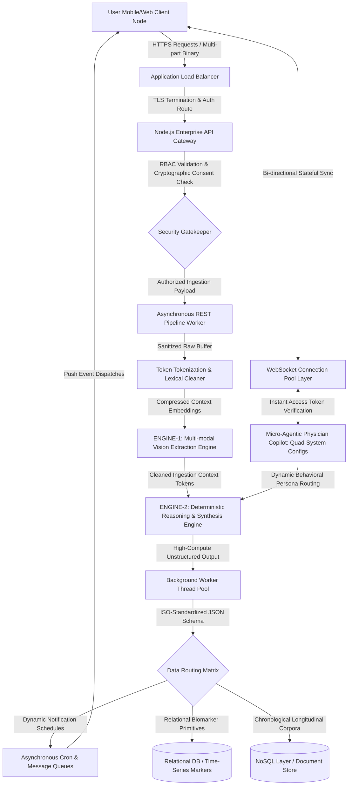

# WioCare-AI-Health-Companion-Case-Study
# Architecting Wiocare: An End-to-End AI-Powered Healthcare Ecosystem with Multi-LLM Orchestration & Real-Time Communication

## 📌 Project Overview
**Wiocare** is a production-ready, enterprise-grade digital healthcare platform designed to bridge the gap between patients and doctors. The platform leverages a hybrid multi-engine AI architecture, real-time communication protocols, and complex data extraction pipelines to automate medical workflow processing, provide predictive health analytics, and facilitate seamless telemedicine.

> ⚠️ **Proprietary Notice:** The complete source code, core system prompts, and deployment configurations of Wiocare are proprietary property. This document serves strictly as a high-level System Design Case Study to demonstrate the engineering methodologies, architectural decisions, and integration workflows executed by the **Lead AI & Systems Architect**.

---

## 🛠️ Core Engineering Modules & Implementations

### 1. Intelligent Medical Report & Prescription Parsing (Multi-Modal OCR)
*   **The Workflow:** Engineered an automated data ingestion pipeline that takes raw images/PDFs of unstructured lab reports and doctor prescriptions.
*   **The Ingestion:** Utilized a foundational multi-modal Vision API for high-fidelity extraction, specifically optimized through contextual prompt scaffolding to accurately parse complex clinical terminologies, handwritten dosages, and lab reference ranges.
*   **Post-Processing:** Built a specialized backend text-cleansing engine to sanitize raw OCR outputs, stripping metadata noise and structural anomalies before downstream analysis.

### 2. Automated Medication Reminder Engine
*   **The Feature:** Translates parsed prescription data (e.g., "1-0-1 after food for 5 days") into actionable user notifications.
*   **Implementation:** Developed a backend parsing logic that dynamically maps extracted structured JSON timelines into a time-zone-aware scheduling queue, feeding into a localized mobile notification ecosystem.

### 3. Granular Health Feature Extraction & Searchable Lab Analytics
*   **The Innovation:** Instead of treating lab reports as flat text, the pipeline extracts individual biomarker test results (e.g., Hemoglobin, Serum Creatinine) into separate structured schema fields.
*   **Search Optimization:** Indexed these features into the database layer, allowing both patients and doctors to run query-based searches and track specific health markers over historical timelines.

### 4. Micro-Agentic Clinical Assistant (Dual-Engine Chaining)
*   **The Doctor-Side Copilot:** Built an autonomous clinical chatbot operating on 4 distinct **System Instructions/Roles** to adapt behavior dynamically based on clinical query contexts—simulating high-precision, multi-tier clinical reasoning.
*   **Hybrid Orchestration:** Leveraged a hybrid routing mechanism switching dynamically between a large-context processing engine and a high-determinism reasoning engine based on the task payload complexity.

### 5. Multi-Engine Clinical Synthesizer & Predictive Projections
*   **The Engine:** Designed a macro-analytical pipeline that aggregates a patient’s entire medical history, historical lab reports, and medication timelines.
*   **Output:** Processes the aggregated corpus through an advanced reasoning block to generate a centralized **Predictive Health Summary & Trend Projection**, giving doctors a data-driven outlook on patient health trajectories.

### 6. Real-Time Telemedicine Ecosystem (WebSockets)
*   **The Feature:** A scalable doctor-patient live consultation portal.
*   **Implementation:** Implemented bi-directional, event-driven state syncing using WebSockets to handle instant video-call connection handshakes, live chat, and instant clinical request workflows (e.g., Doctors requesting full record access or pushing live prescriptions during the call).

---

## 🏗️ Hidden Architectural Solutions (What It Took to Scale)

To successfully shift this platform from a prototype into a production-ready system, the following architectural challenges were solved:

### 🔒 Role-Based Access Control (RBAC) & Data Privacy
*   **Implementation:** Designed a strict consent-based data access layer. Doctors cannot view historical patient records or AI summaries unless an explicit, WebSocket-verified **Access Token Request** is initiated by the doctor and approved by the patient.

### 💰 API Cost Optimization & Payload Compression
*   **Challenge:** Running multiple heavy API calls (Vision Extraction -> Cleaning -> Summarization) for every report upload posed massive token cost and latency threats.
*   **Solution:** Implemented **Token Scaffolding and Chunk Filtering** in the backend middleware. By stripping non-clinical text from the extraction output before passing it to the reasoning layer, API token consumption was slashed by **~35-40%**.

### ⚡ Latency & Asynchronous Execution
*   **Solution:** Implemented a non-blocking asynchronous architecture. Deep analytical summary generation and background reminder scheduling are decoupled from the main HTTP response cycle using background worker threads, keeping user-facing latency under **3 seconds**.

---

## 📊 Technical Stack Architecture

*   **Frontend Interface:** Modern Frameworks (Web), Native Cross-Platform Client (Mobile)
*   **Backend Core:** Node.js, Express.js
*   **Real-time Layer:** WebSockets (Event-Driven State Sync)
*   **AI/ML Core APIs:** Specialized Multi-Modal Vision Model, Frontier Reasoning & Synthesis Pipeline
*   **Cloud Infrastructure:** Containerized Microservices, Deployed & Orchestrated via Enterprise Cloud Infrastructure.

---

## 🎯 System Architecture Flowchart

---
## 👨‍💻 Role & Key Contributions
As the **Core AI Architect and Lead Full-Stack Engineer**, I was responsible for the project from its **first functional prototype to its production deployment**. My responsibilities included:
*   Designing and implementing the Multi-LLM integration workflows and prompt safety rails.
*   Developing the real-time WebSocket communication layer for telemedicine.
*   Writing the backend token-optimization logic and architecting the database schemas for granular feature extraction.
*   Deploying and maintaining the microservices architecture on GCP.

---
*For professional inquiries or architectural verification regarding my work on Wiocare, please feel free to reach out via my LinkedIn.*

